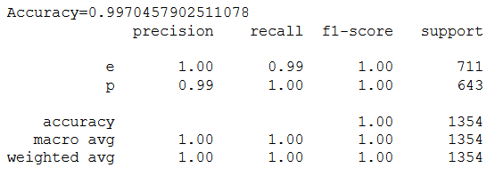
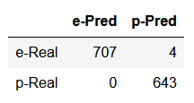

# naive_bayes_algorithm
Implementation of Naive Bayes Algorithm.

## Dataset Description
Mushroom dataset is present in uciml database. The Dataset contains data of 8124 mushroom samples. Each samples consists information about 23 features of mushroom including its class (which can be either 'p' or 'e')

## Results
The model is trained for  on the training set (6770 samples) and One sixth of dataset (1354 samples) is used for testing.

### Accuracy, Precision, Recall and F1-score

### Confusion Matrix
